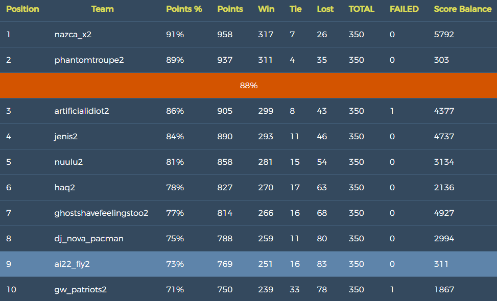

# RMIT AI'22 - Project - Pacman Capture the Flag

The purpose of this project is to implement a Pacman Autonomous Agent that can play and compete in the RMIT AI'22 _Pacman Capture the Flag tournament_:

 <p align="center"> 
    
    
 </p>
 
Note that the Pacman tournament has different rules as it is a game of two teams, where your Pacmans become ghosts in certain areas of the grid. Please read carefully the rules of the Pacman tournament. Understanding it well and designing a controller for it is part of the expectations for this project. Additional technical information on the contest project can be found in file [CONTEST.md](CONTEST.md).

### Table of contents

- [RMIT AI'22 - Project - Pacman Capture the Flag](#rmit-ai22---project---pacman-capture-the-flag)
  - [Table of contents](#table-of-contents)
  - [1. Our task](#1-our-task)
  - [2. Inter-University Competition](#2-inter-university-competition)
  - [3. Getting Started](#3-gettting-started)

## 1. Our task

**Our task** is to develop an autonomous Pacman agent team to play the [Pacman Capture the Flag Contest](http://ai.berkeley.edu/contest.html) by suitably modifying file `myTeam.py` (and possibly some other auxiliary files you may implement). The code submitted should be internally commented at high standards and be error-free and _never crash_.

In our solution, we have used at **least 2 AI-related techniques** that have been discussed in the subject and explored by us independently, and we combined them to get a better outcome. Some techniques that we have used consider are:

1. Heuristic Search Algorithms (using general or Pacman specific heuristic functions).
2. Monte Carlo Tree Search or UCT (Model-Free MDP).

## 1.2 Pre-contest feedback contests

We will be running **_feedback_ contests** based on preliminary versions of teams' agents in the weeks before the final project submission. We will start once **five teams** have submitted their preliminary agents by tagging their repos with "`testing`".

Participating in these pre-contests will give you **a lot of insights** on how your solution is performing and how to improve it. Results, including replays for every game, will be available only for those teams that have submitted.

You can re-submit multiple times, and we will just run the version tagged `testing`. These tournaments carry no marking at all; they are just designed for **continuous feedback** for you to analyse and improve your solution! You do not need to certify these versions.

We will try to run these pre-competitions frequently, at least once a day once enough teams are submitting versions.

The earlier you submit your agents, the more feedback you will receive and the better your chances of earning a high ranking!

## 2. Inter-University Competition

The top teams of the final tournament will be inducted to the [RMIT-UoM Pacman Hall of Fame](https://sites.google.com/view/pacman-capture-hall-fame/) and will qualify to the yearly championship across RMIT and The University of Melbourne, which runs every year with the best teams since 2017 onward.

## 2.1 Final result

On our final tournament run, we have obtained the 9th out of 60 teams.

<p align="center"> 
    
 </p>

## 3. Getting Started

By default, you can run a game with the simple `baselineTeam` that the staff has provided:

```bash
$ python3 capture.py
```

**Make sure you are using python3**

A wealth of options are available to you:

```bash
$ python3 capture.py --help
```

There are four slots for agents, where agents 0 and 2 are always on the red team, and 1 and 3 are on the blue team. Agents are created by agent factories (one for Red, one for Blue). See the section on designing
agents for a description of the agents invoked above. The only team that we provide is the `baselineTeam`. It is chosen by default as both the red and blue team, but as an example of how to choose teams:

```python
$ python3 capture.py -r baselineTeam -b baselineTeam
```

which specifies that the red team `-r` and the blue team `-b` are both created from `baselineTeam.py`.

To specify agents elsewhere:

```shell
$ python3 capture.py -r path/to/red/team/myTeam.py -b path/to/blue/team/myTeam.py
```

To control one of the four agents with the keyboard, pass the appropriate option:

```shell
$ python capture.py --keys0
```

The arrow keys control your character, which will change from ghost to Pacman when crossing the center line.
You can also play against our agents with the following command:

```shell
$ python capture.py --keys0 -b myTeam
```

You can also change the teams by changing the flag before 'myTeam'.

To change the map settings:

```shell
$ python capture.py -l mapName
```

There are 12 maps that are stored in the folder 'layouts'. You can also generate a random map by using the following command:

```shell
$ python capture.py -l RANDOM[number]
```

A number is needed to seed the generation of the map, do not include the braces when putting the number behind 'RANDOM'.

To watch replays provided by us:

```shell
$ python capture.py --replay replays/filename.replay
```

A color is specified at the end of the file name to identify which team our agents are on.
